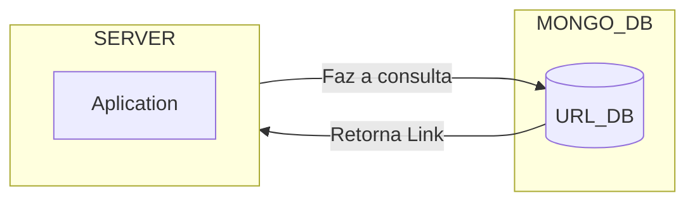
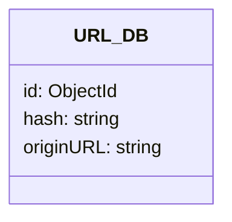

# Encurtador URL 
## Baseado no projeto da DIO

## Estrutura:


## Banco de Dados:


## Resumo do funcionamento
> Basicamente quando você adiciona um link, ele verifica se este link já existe, se não ele cria um hash novo, adicionando o link destino e o link "inicial" desta URL. Quando você faz a pesquisa com o hash. Se existir, manda para o link de origem, se não retorna um erro 400.

## Fluxograma Básico

```mermaid
    flowchart LR
        link[[Manda Link]]
        db[(banco de dados)]

        verifica{Link existe?}
        se[Sim]
        se2[Não]
        
        link --> db --> verifica --> se & se2

        retorno1[Retorna nulo]
        retorno2[Adiciona link no banco]

         se --> retorno1 --> FIM
         se2 --> retorno2
         retorno2 --> verifica

 ```